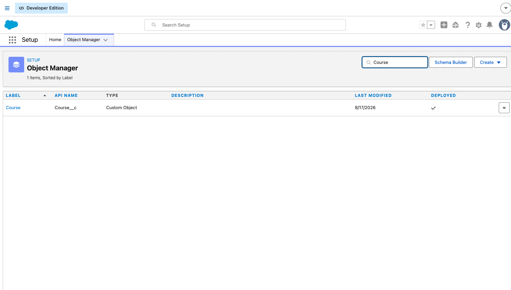
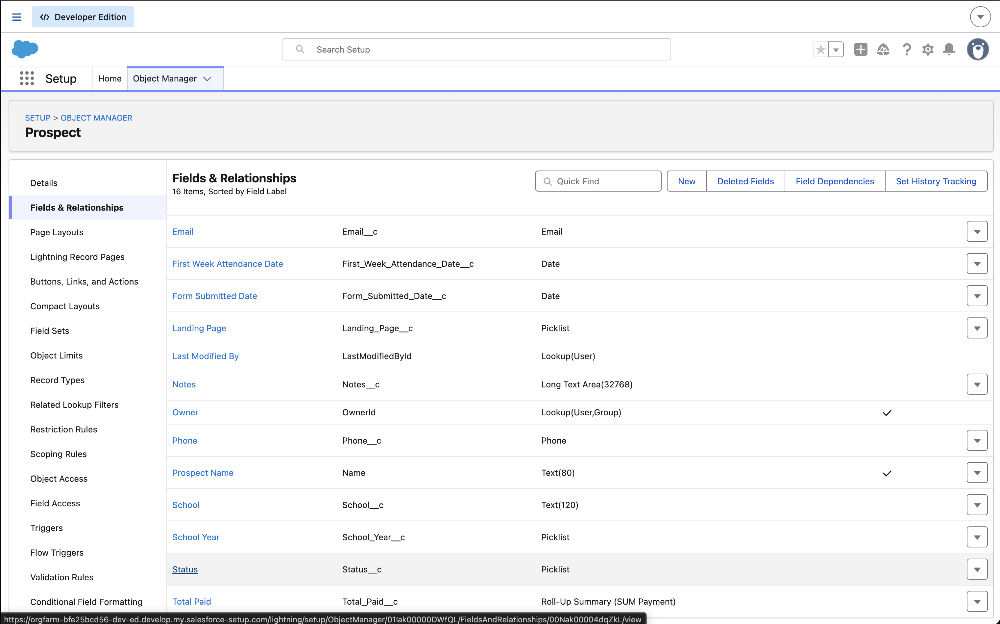
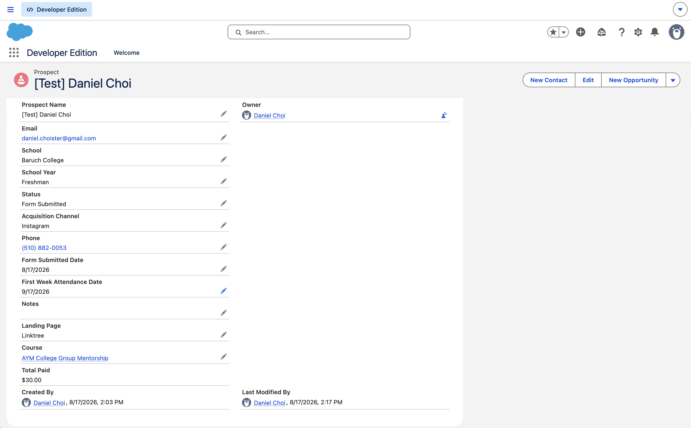
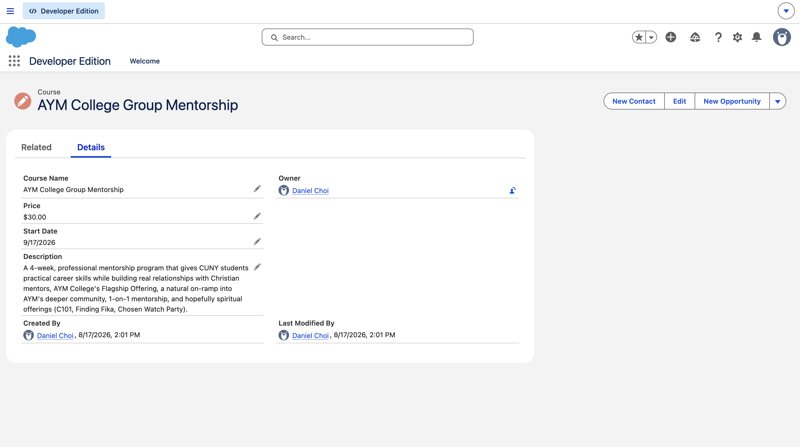

# Course Enrollment & Conversion Tracker

A Salesforce app that models the actual enrollment funnel I ran at ISMP
Korea: Instagram → Linktree → Google Form intake → payment → first-week
attendance, rebuilt as a real data model and paired with documentation
written the way I'd write it for a real product team.

## Why I Built This

<!-- TODO: this is a draft in your voice — read it, and only keep it if it
     actually sounds like you. Edit freely, this is the one section that
     most needs to sound like a real person, not a template. -->

At ISMP Korea, I ran the actual growth funnel for a new English-learning
program: an Instagram account I grew to 1,208 followers, driving 7,139
profile visits and 919 taps on the Linktree link in the bio over a single
90-day window, into a Linktree that converted 91.2% of its own 1,405
visitors through to a Google Form. That form captured each prospect's
school year, school, and which course they wanted, followed by payment and
first-week attendance. I used audience research and iteration on that
funnel to increase signup conversion by 203%, but at the time it lived
across Instagram insights, a Google Form, and a spreadsheet, not a single
system of record. This project rebuilds that same funnel as an actual
Salesforce data model, seeded with the real numbers behind it (see
[`docs/campaign-data.md`](docs/campaign-data.md)), and documents it the way
I'd want it documented if I were handing it off to someone else running
the next cohort.

## What It Does

- Tracks a prospect's progress through four stages that mirror the real funnel: Lead, Form Submitted, Paid, Attended Week 1
- Captures acquisition channel and landing page separately (e.g. Instagram → Linktree), so the top-level channel and the specific link that converted can be reported independently
- Stores the school year, school, and course selection captured on the Google Form intake
- Relates each prospect to the specific course they're interested in
- Records individual payment transactions against a prospect, rather than a single paid/unpaid flag
- Tracks first-week attendance as its own step, so paid-but-didn't-attend is visible instead of assumed away
- Automatically totals a prospect's payments via a `Total Paid` roll-up summary field

<!-- TODO: add a screenshot or short GIF of the app here once it exists,
     e.g.    -->

## Screenshots

*The three custom objects behind the app.*

*Prospect's fields, including the Status funnel stage and the Total Paid roll-up.*

*A real test record moved through the funnel, with Total Paid calculated automatically from its related Payment records.*

*One of the course offerings prospects can select on the Google Form.*

## Documentation

- [`docs/data-model.md`](docs/data-model.md) — objects, fields, and relationships
- [`docs/admin-setup.md`](docs/admin-setup.md) — how to configure this from a blank org
- [`docs/user-guide.md`](docs/user-guide.md) — how to use the app day to day
- [`docs/campaign-data.md`](docs/campaign-data.md) — the real 3-month Instagram and Linktree performance this funnel is modeled on

## Built With

- **Salesforce** (Developer Edition org) — the app itself
- **Markdown** — all documentation in this repo
- **Git / GitHub** — version control and project history
- **Claude** — used to draft the initial data model spec and documentation
  structure, which I then implemented in Salesforce and edited by hand to
  match what I actually built
<!-- TODO: keep that last line only if it stays true — once you've built
     the real thing and edited these docs yourself, it should accurately
     describe what happened, not just what happened right now. -->

## About Me

I'm Daniel Choi, an early-career technical writer with experience producing
user-facing documentation, training materials, and system guides for
enterprise software. More of my work:
[Portfolio](https://app.notion.com/p/Daniel-Choi-Portfolio-33481903f3eb8013b522ee21a2342c7b)
· [LinkedIn](https://linkedin.com/in/daniel-j-choi)
